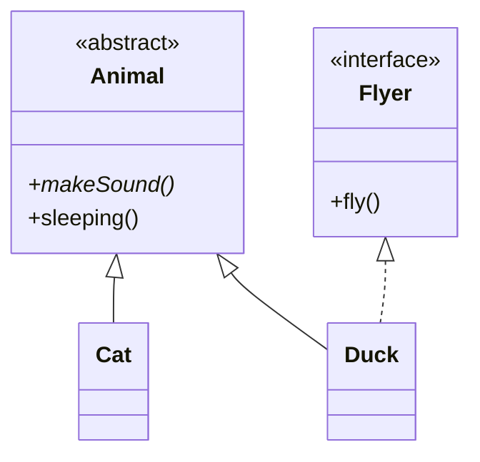

# Classes, abstract classes e interfaces

In this module, the concepts of classes, abstract classes and interfaces are being studied. The following is a class diagram for the exercise in java.

```mermaid
classDiagram
	class Animal{
		<<abstract>>
		+makeSound()*
		+sleeping()
	}
	
	class Flyer{
		<<interface>>
		+fly()
	}
	
	class Cat{
		
	}
  class Duck{
	  
  }
  
  Animal <|-- Cat
  Animal <|-- Duck
  Flyer <|.. Duck
```